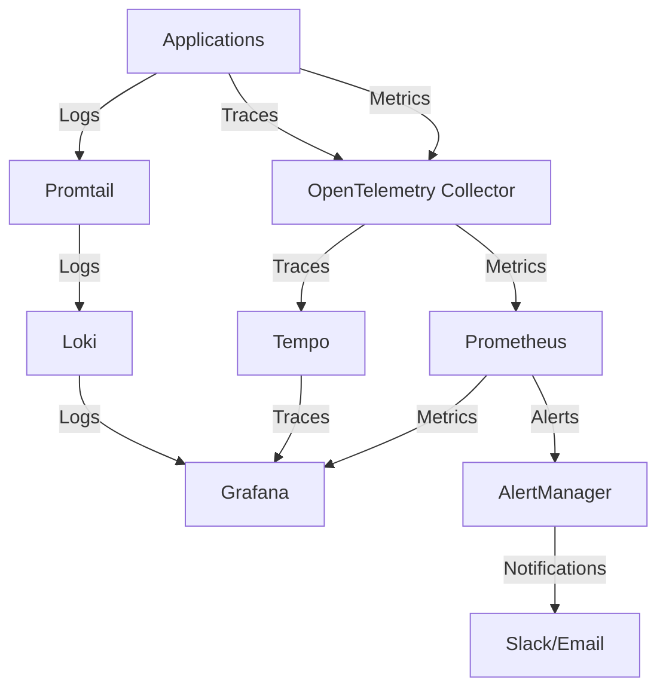

# AIOps Monitoring Stack

Комплексный мониторинг-стек для AIOps решений, включающий в себя сбор метрик, логов, трейсов и специализированный ML-мониторинг.

## Содержание

- [Обзор](#обзор)
- [Архитектура](#архитектура)
- [Предварительные требования](#предварительные-требования)
- [Установка](#установка)
- [Конфигурация](#конфигурация)
- [Использование](#использование)
- [ML-мониторинг](#ml-мониторинг)
- [Устранение неполадок](#устранение-неполадок)
- [Разработка](#разработка)

## Обзор

Стек включает в себя следующие компоненты:

- **Prometheus**: сбор и хранение метрик
- **Grafana**: визуализация метрик, логов и трейсов
- **Loki**: агрегация и хранение логов
- **Promtail**: сбор логов с узлов
- **Tempo**: распределенная трассировка
- **OpenTelemetry Collector**: сбор телеметрии
- **AlertManager**: управление оповещениями

## Архитектура



## Предварительные требования

1. Kubernetes кластер (версия 1.19+)
2. kubectl (настроенный для работы с кластером)
3. Минимальные ресурсы:
   - CPU: 4 cores
   - RAM: 8GB
   - Storage: 50GB

## Установка

### 1. Клонирование репозитория

```bash
git clone https://github.com/your-org/aiops-infra.git
cd aiops-infra
```

### 2. Настройка окружения

```bash
# Создание namespace
kubectl create namespace monitoring

# Настройка RBAC (если требуется)
kubectl apply -f kubernetes/monitoring/rbac.yaml
```

### 3. Установка компонентов

```bash
# Переход в директорию с манифестами
cd kubernetes/monitoring

# Запуск скрипта установки
chmod +x deploy.sh
./deploy.sh
```

### 4. Проверка установки

```bash
# Проверка статуса подов
kubectl -n monitoring get pods

# Проверка сервисов
kubectl -n monitoring get svc

# Проверка конфигмапов
kubectl -n monitoring get configmaps
```

## Конфигурация

### Prometheus

Основной файл конфигурации: `kubernetes/monitoring/prometheus-deployment.yaml`

```yaml
# Пример настройки scrape_configs
scrape_configs:
  - job_name: 'kubernetes-pods'
    kubernetes_sd_configs:
      - role: pod
```

### Grafana

URL: `http://localhost:3000`
Credentials: admin/aiops-admin-password

Доступные дашборды:
- Logs Overview
- Traces Overview
- ML Models Monitoring

### Loki

Конфигурация логов: `kubernetes/monitoring/loki-deployment.yaml`

```yaml
# Пример настройки retention
limits_config:
  retention_period: 7d
```

### AlertManager

Настройка оповещений: `kubernetes/monitoring/alertmanager-deployment.yaml`

```yaml
# Пример настройки Slack
receivers:
- name: 'slack'
  slack_configs:
  - api_url: 'https://hooks.slack.com/services/YOUR/SLACK/WEBHOOK'
```

## Использование

### Port Forwarding

```bash
# Grafana
kubectl -n monitoring port-forward deployment/grafana 3000:3000

# Prometheus
kubectl -n monitoring port-forward deployment/prometheus 9090:9090

# AlertManager
kubectl -n monitoring port-forward deployment/alertmanager 9093:9093

# Loki
kubectl -n monitoring port-forward statefulset/loki 3100:3100

# Tempo
kubectl -n monitoring port-forward statefulset/tempo 3200:3200

# OpenTelemetry Collector
kubectl -n monitoring port-forward deployment/otel-collector 8889:8889
```

### Доступ к UI

- Grafana: http://localhost:3000
- Prometheus: http://localhost:9090
- AlertManager: http://localhost:9093
- Loki: http://localhost:3100
- Tempo: http://localhost:3200
- OpenTelemetry Metrics: http://localhost:8889/metrics

## ML-мониторинг

### Доступные метрики

1. Метрики качества моделей:
   - Accuracy
   - Precision
   - Recall
   - F1-score

2. Метрики производительности:
   - Latency
   - Throughput
   - Resource usage

3. Метрики данных:
   - Data drift
   - Feature drift
   - Data quality

### Алерты

```yaml
# Пример настройки ML-алертов
- alert: ModelAccuracyDrop
  expr: model_accuracy:avg_5m < 0.8
  for: 5m
  labels:
    severity: warning
```

### Графики

Дашборд ML Models Monitoring включает:
- Точность моделей
- Латентность предсказаний
- Дрейф признаков
- Пропускная способность
- Проблемы с качеством данных
- Использование ресурсов

## Устранение неполадок

### Проверка логов

```bash
# Логи Prometheus
kubectl -n monitoring logs -f deployment/prometheus

# Логи Grafana
kubectl -n monitoring logs -f deployment/grafana

# Логи Loki
kubectl -n monitoring logs -f statefulset/loki-0

# Логи OpenTelemetry Collector
kubectl -n monitoring logs -f deployment/otel-collector
```

### Частые проблемы

1. Prometheus не собирает метрики:
```bash
kubectl -n monitoring exec -it deployment/prometheus -- wget -qO- http://localhost:9090/-/ready
```

2. Loki не получает логи:
```bash
kubectl -n monitoring exec -it statefulset/loki-0 -- wget -qO- http://localhost:3100/ready
```

3. Tempo не получает трейсы:
```bash
kubectl -n monitoring exec -it statefulset/tempo-0 -- wget -qO- http://localhost:3200/ready
```

## Разработка

### Добавление новых метрик

1. Создайте recording rule в `kubernetes/monitoring/ml-metrics-rules.yaml`:
```yaml
- record: new_metric:avg_5m
  expr: avg_over_time(your_metric[5m])
```

2. Добавьте панель в Grafana дашборд:
```bash
kubectl -n monitoring apply -f kubernetes/monitoring/grafana-dashboards-configmap.yaml
```

### Добавление алертов

1. Создайте правило в `kubernetes/monitoring/ml-metrics-rules.yaml`:
```yaml
- alert: NewAlert
  expr: metric > threshold
  for: 5m
  labels:
    severity: warning
```

2. Примените изменения:
```bash
kubectl apply -f kubernetes/monitoring/ml-metrics-rules.yaml
```

### Обновление компонентов

```bash
# Обновление всего стека
./deploy.sh

# Обновление отдельных компонентов
kubectl -n monitoring apply -f kubernetes/monitoring/component-name.yaml
```

## Лицензия

MIT

## Поддержка

При возникновении проблем:
1. Проверьте [секцию с устранением неполадок](#устранение-неполадок)
2. Создайте issue в репозитории
3. Обратитесь к команде поддержки 