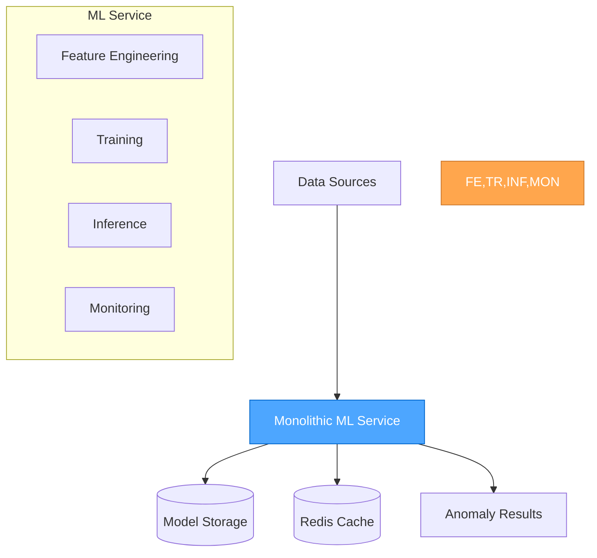
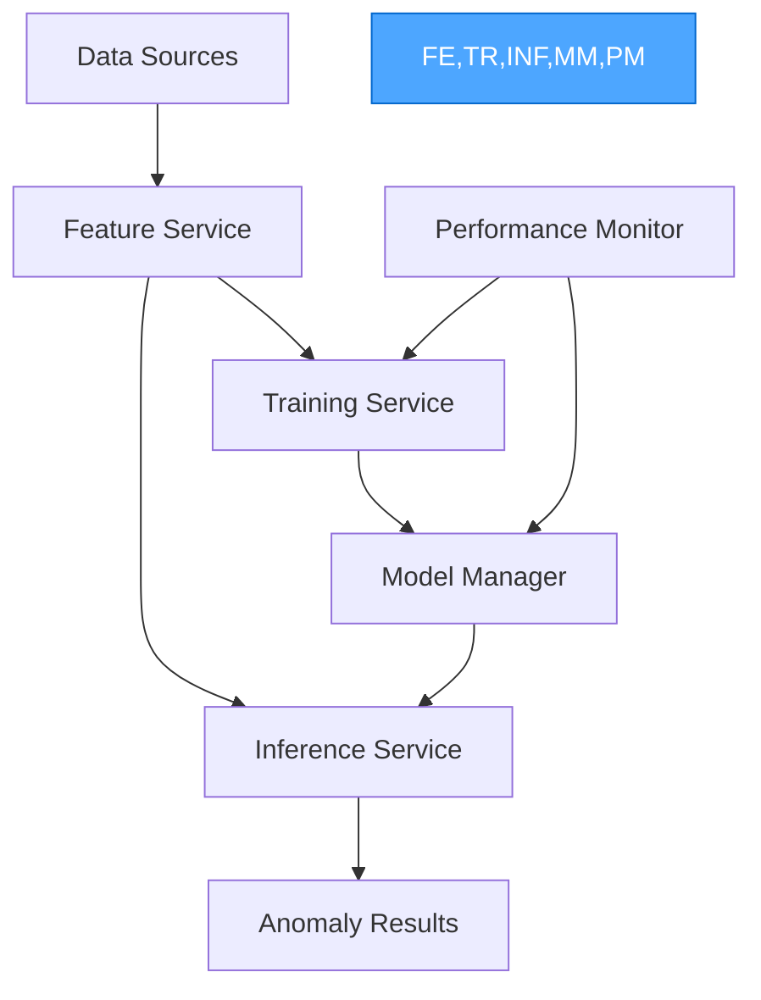
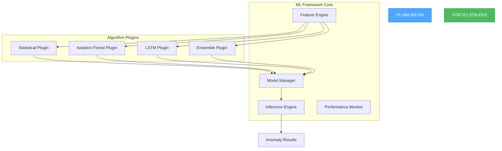
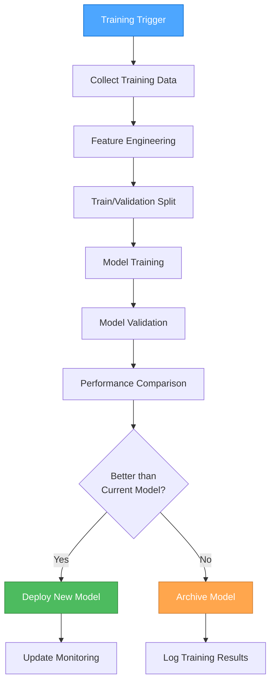

# 🎨🎨🎨 ENTERING CREATIVE PHASE: ML PIPELINE ARCHITECTURE 🎨🎨🎨

**Focus:** Unified framework для multiple ML detector types  
**Objective:** Design modular, extensible ML pipeline с automatic training и performance monitoring  
**Requirements:** Support multiple algorithms, real-time inference, model versioning, automatic retraining  

## 📋 ARCHITECTURE DECISION RECORD: ML PIPELINE SYSTEM

### Context

#### System Requirements
- **Multiple Algorithms**: Statistical, Isolation Forest, LSTM, Ensemble methods
- **Real-time Inference**: <10ms latency for anomaly detection
- **Model Training**: Automated training на historical data
- **Model Versioning**: Track model performance и rollback capabilities
- **Performance Monitoring**: Automatic model performance degradation detection
- **Feature Engineering**: Automated feature extraction и transformation

#### Technical Constraints
- **Existing Infrastructure**: Go backend, PostgreSQL, Redis
- **Data Sources**: Prometheus metrics, application logs, Kubernetes events
- **Memory Constraints**: Efficient memory usage для real-time processing
- **Scalability**: Support для multiple tenants и thousands of time series

### Component Analysis

#### Core Components
- **ML Model Manager**: Model lifecycle, versioning, deployment
- **Feature Engine**: Data preprocessing, feature extraction, normalization
- **Training Pipeline**: Automated training, validation, hyperparameter tuning
- **Inference Engine**: Real-time prediction с performance monitoring
- **Performance Monitor**: Model drift detection, retraining triggers

#### Interactions
- **Data Sources** → **Feature Engine** → **Training Pipeline** → **Model Manager**
- **Real-time Data** → **Feature Engine** → **Inference Engine** → **Anomaly Detection**
- **Performance Monitor** → **Training Pipeline** (retraining triggers)

---

## 🏗️ ML ARCHITECTURE OPTIONS EVALUATION

### Option 1: Monolithic ML Service

**Description:** Single service handling all ML operations



**Pros:**
- ✅ Simple deployment и management
- ✅ Easy data sharing between components
- ✅ Consistent performance monitoring
- ✅ Simplified debugging

**Cons:**
- ❌ Single point of failure
- ❌ Difficult to scale individual components
- ❌ Hard to add new algorithms independently
- ❌ Resource contention between training и inference

**Technical Fit:** Medium (good for MVP)  
**Complexity:** Low  
**Scalability:** Low

### Option 2: Microservices ML Pipeline

**Description:** Separate services для each ML function



**Pros:**
- ✅ Independent scaling of components
- ✅ Technology diversity (different languages/frameworks)
- ✅ Fault isolation between services
- ✅ Easy to add new algorithm services

**Cons:**
- ❌ Complex deployment и orchestration
- ❌ Network latency between services
- ❌ Data consistency challenges
- ❌ Increased operational complexity

**Technical Fit:** Medium (good for large scale)  
**Complexity:** High  
**Scalability:** High

### Option 3: Plugin-based ML Framework

**Description:** Core framework с pluggable algorithm implementations



**Pros:**
- ✅ Easy to add new algorithms без core changes
- ✅ Consistent interface для all algorithms
- ✅ Shared infrastructure (caching, monitoring)
- ✅ Simple deployment (single binary)
- ✅ Good balance of modularity и simplicity

**Cons:**
- ❌ Plugin system complexity
- ❌ Potential memory leaks from plugins
- ❌ Limited language diversity
- ❌ Shared resource contention

**Technical Fit:** High (good fit для current needs)  
**Complexity:** Medium  
**Scalability:** Medium-High

---

## 🎯 DECISION: PLUGIN-BASED ML FRAMEWORK

### Rationale

**Chosen Option:** Plugin-based ML Framework

**Key Decision Factors:**
1. **Extensibility**: Easy to add new algorithms
2. **Simplicity**: Single deployment unit
3. **Performance**: No network overhead between components
4. **Team Capacity**: Manageable complexity для current team
5. **Go Ecosystem**: Leverage Go's plugin capabilities

### Implementation Design

#### Core Framework Architecture
```go
// ML Framework Core
type MLFramework struct {
    featureEngine    *FeatureEngine
    modelManager     *ModelManager
    inferenceEngine  *InferenceEngine
    performanceMonitor *PerformanceMonitor
    plugins          map[string]AlgorithmPlugin
}

// Algorithm Plugin Interface
type AlgorithmPlugin interface {
    Name() string
    Version() string
    Initialize(config AlgorithmConfig) error
    Train(data TrainingData) (Model, error)
    Predict(features []float64) (float64, error)
    GetMetrics() AlgorithmMetrics
    Cleanup() error
}

// Model Interface
type Model interface {
    ID() string
    Version() string
    Algorithm() string
    Predict(features []float64) (float64, error)
    Serialize() ([]byte, error)
    Deserialize([]byte) error
    Metadata() ModelMetadata
}
```

#### Feature Engineering Pipeline
```go
type FeatureEngine struct {
    extractors   []FeatureExtractor
    transformers []FeatureTransformer
    normalizers  []FeatureNormalizer
    cache        *FeatureCache
}

type FeatureExtractor interface {
    Extract(data TimeSeriesData) ([]Feature, error)
    FeatureNames() []string
}

// Built-in feature extractors
type StatisticalExtractor struct{}
func (se *StatisticalExtractor) Extract(data TimeSeriesData) ([]Feature, error) {
    return []Feature{
        {Name: "mean", Value: calculateMean(data.Values)},
        {Name: "std", Value: calculateStd(data.Values)},
        {Name: "trend", Value: calculateTrend(data.Values)},
        {Name: "seasonality", Value: detectSeasonality(data.Values)},
    }, nil
}

type TimeWindowExtractor struct {
    windowSize int
}

type FrequencyExtractor struct {
    fftSize int
}
```

#### Model Manager с Versioning
```go
type ModelManager struct {
    storage     ModelStorage
    registry    ModelRegistry
    versions    map[string][]ModelVersion
    active      map[string]string // algorithm -> active model ID
}

type ModelVersion struct {
    ID          string
    Algorithm   string
    Version     string
    Performance ModelPerformance
    Metadata    ModelMetadata
    CreatedAt   time.Time
    Status      ModelStatus
}

type ModelPerformance struct {
    Accuracy      float64
    Precision     float64
    Recall        float64
    F1Score       float64
    FalsePositive float64
    TrainingTime  time.Duration
    InferenceTime time.Duration
}

func (mm *ModelManager) DeployModel(algorithm string, modelID string) error {
    // Validate model performance
    // Update active model mapping
    // Notify inference engine
    // Log deployment event
}

func (mm *ModelManager) RollbackModel(algorithm string) error {
    // Find previous stable version
    // Deploy previous model
    // Update metrics
}
```

#### Algorithm Plugin Implementations

##### Statistical Plugin
```go
type StatisticalPlugin struct {
    config StatisticalConfig
    models map[string]*StatisticalModel
}

type StatisticalModel struct {
    ID        string
    Method    StatMethod // ZSCORE, MAD, IQR
    Window    []float64
    Mean      float64
    Std       float64
    Threshold float64
    Metadata  ModelMetadata
}

func (sp *StatisticalPlugin) Train(data TrainingData) (Model, error) {
    model := &StatisticalModel{
        ID:     generateModelID(),
        Method: sp.config.Method,
        Window: make([]float64, sp.config.WindowSize),
    }
    
    // Calculate baseline statistics
    model.Mean = calculateMean(data.Values)
    model.Std = calculateStd(data.Values)
    model.Threshold = calculateThreshold(data.Values, sp.config.Sensitivity)
    
    return model, nil
}

func (sm *StatisticalModel) Predict(features []float64) (float64, error) {
    value := features[0] // Assuming univariate for now
    
    switch sm.Method {
    case ZSCORE:
        zscore := math.Abs(value-sm.Mean) / sm.Std
        return zscore, nil
    case MAD:
        mad := calculateMAD(sm.Window)
        score := math.Abs(value-median(sm.Window)) / mad
        return score, nil
    }
    
    return 0, fmt.Errorf("unknown method: %v", sm.Method)
}
```

##### Isolation Forest Plugin  
```go
type IsolationForestPlugin struct {
    config IsolationForestConfig
    models map[string]*IsolationForestModel
}

type IsolationForestModel struct {
    ID            string
    Trees         []*IsolationTree
    SubsampleSize int
    NumTrees      int
    Contamination float64
    FeatureNames  []string
}

type IsolationTree struct {
    Root *IsolationNode
}

type IsolationNode struct {
    Feature   int
    Threshold float64
    Left      *IsolationNode
    Right     *IsolationNode
    Size      int
    Height    int
}

func (ifp *IsolationForestPlugin) Train(data TrainingData) (Model, error) {
    model := &IsolationForestModel{
        ID:            generateModelID(),
        Trees:         make([]*IsolationTree, ifp.config.NumTrees),
        SubsampleSize: ifp.config.SubsampleSize,
        NumTrees:      ifp.config.NumTrees,
        Contamination: ifp.config.Contamination,
        FeatureNames:  data.FeatureNames,
    }
    
    // Build isolation trees
    for i := 0; i < model.NumTrees; i++ {
        subsample := sampleData(data, model.SubsampleSize)
        model.Trees[i] = buildIsolationTree(subsample, 0)
    }
    
    return model, nil
}

func (ifm *IsolationForestModel) Predict(features []float64) (float64, error) {
    totalPathLength := 0.0
    
    for _, tree := range ifm.Trees {
        pathLength := calculatePathLength(tree.Root, features, 0)
        totalPathLength += pathLength
    }
    
    avgPathLength := totalPathLength / float64(len(ifm.Trees))
    anomalyScore := math.Pow(2, -avgPathLength/c(ifm.SubsampleSize))
    
    return anomalyScore, nil
}
```

#### Performance Monitoring System
```go
type PerformanceMonitor struct {
    metrics        map[string]*AlgorithmMetrics
    thresholds     map[string]PerformanceThreshold
    retrainTrigger chan RetrainRequest
}

type AlgorithmMetrics struct {
    Algorithm         string
    ModelVersion      string
    PredictionCount   int64
    AnomalyCount      int64
    FalsePositiveRate float64
    LatencyP95        time.Duration
    AccuracyTrend     []float64
    LastUpdated       time.Time
}

type PerformanceThreshold struct {
    MaxFalsePositiveRate float64
    MaxLatency           time.Duration
    MinAccuracy          float64
    AccuracyWindowSize   int
}

func (pm *PerformanceMonitor) CheckPerformance(algorithm string) {
    metrics := pm.metrics[algorithm]
    threshold := pm.thresholds[algorithm]
    
    if metrics.FalsePositiveRate > threshold.MaxFalsePositiveRate {
        pm.triggerRetrain(algorithm, "high_false_positive_rate")
    }
    
    if len(metrics.AccuracyTrend) >= threshold.AccuracyWindowSize {
        avgAccuracy := calculateMean(metrics.AccuracyTrend)
        if avgAccuracy < threshold.MinAccuracy {
            pm.triggerRetrain(algorithm, "low_accuracy")
        }
    }
}

func (pm *PerformanceMonitor) triggerRetrain(algorithm string, reason string) {
    pm.retrainTrigger <- RetrainRequest{
        Algorithm: algorithm,
        Reason:    reason,
        Timestamp: time.Now(),
    }
}
```

---

## 🎨 CREATIVE CHECKPOINT: ML FRAMEWORK DESIGN

**Progress:** ✅ Plugin architecture designed, core interfaces defined  
**Decisions:** 
- ✅ Plugin-based framework chosen for extensibility
- ✅ Model versioning и performance monitoring integrated  
- ✅ Feature engineering pipeline designed

**Next Steps:** Design training pipeline и automatic retraining

---

## 🔄 TRAINING PIPELINE DESIGN

### Automated Training Workflow



### Training Pipeline Implementation
```go
type TrainingPipeline struct {
    dataCollector    DataCollector
    featureEngine    *FeatureEngine
    algorithms       map[string]AlgorithmPlugin
    validator        ModelValidator
    deploymentGate   DeploymentGate
    scheduler        TrainingScheduler
}

type TrainingRequest struct {
    Algorithm     string
    TriggerReason string
    DataRange     TimeRange
    Config        TrainingConfig
}

func (tp *TrainingPipeline) ExecuteTraining(req TrainingRequest) error {
    // 1. Collect training data
    data, err := tp.dataCollector.Collect(req.DataRange)
    if err != nil {
        return fmt.Errorf("data collection failed: %w", err)
    }
    
    // 2. Feature engineering
    features, err := tp.featureEngine.Process(data)
    if err != nil {
        return fmt.Errorf("feature engineering failed: %w", err)
    }
    
    // 3. Train model
    plugin := tp.algorithms[req.Algorithm]
    model, err := plugin.Train(TrainingData{
        Features: features,
        Labels:   data.Labels,
        Config:   req.Config,
    })
    if err != nil {
        return fmt.Errorf("training failed: %w", err)
    }
    
    // 4. Validate model
    performance, err := tp.validator.Validate(model, features)
    if err != nil {
        return fmt.Errorf("validation failed: %w", err)
    }
    
    // 5. Deployment decision
    shouldDeploy, err := tp.deploymentGate.ShouldDeploy(req.Algorithm, performance)
    if err != nil {
        return fmt.Errorf("deployment gate failed: %w", err)
    }
    
    if shouldDeploy {
        return tp.deployModel(model, performance)
    }
    
    return tp.archiveModel(model, performance, "performance_insufficient")
}
```

### Hyperparameter Optimization
```go
type HyperparameterOptimizer struct {
    strategy OptimizationStrategy
    budget   OptimizationBudget
}

type OptimizationStrategy interface {
    Optimize(algorithm AlgorithmPlugin, data TrainingData, space ParameterSpace) (BestParams, error)
}

// Grid Search Implementation
type GridSearchStrategy struct {
    maxIterations int
}

func (gs *GridSearchStrategy) Optimize(
    algorithm AlgorithmPlugin, 
    data TrainingData, 
    space ParameterSpace,
) (BestParams, error) {
    bestParams := BestParams{}
    bestScore := 0.0
    
    for _, params := range space.GenerateGrid() {
        config := TrainingConfig{Parameters: params}
        model, err := algorithm.Train(TrainingData{
            Features: data.Features,
            Labels:   data.Labels,
            Config:   config,
        })
        if err != nil {
            continue
        }
        
        score := evaluateModel(model, data.ValidationSet)
        if score > bestScore {
            bestScore = score
            bestParams = BestParams{
                Parameters: params,
                Score:      score,
            }
        }
    }
    
    return bestParams, nil
}
```

---

## 🔒 MODEL SECURITY & GOVERNANCE

### Model Governance Framework
```go
type ModelGovernance struct {
    auditLogger     AuditLogger
    accessControl   ModelAccessControl
    complianceCheck ComplianceChecker
    riskAssessment  RiskAssessment
}

type ModelAuditEvent struct {
    EventType   string    // TRAIN, DEPLOY, PREDICT, ROLLBACK
    ModelID     string
    Algorithm   string
    UserID      string
    Timestamp   time.Time
    Metadata    map[string]interface{}
    Performance ModelPerformance
}

func (mg *ModelGovernance) LogTraining(modelID string, algorithm string, performance ModelPerformance) {
    event := ModelAuditEvent{
        EventType:   "TRAIN",
        ModelID:     modelID,
        Algorithm:   algorithm,
        Timestamp:   time.Now(),
        Performance: performance,
    }
    mg.auditLogger.Log(event)
}

func (mg *ModelGovernance) ValidateDeployment(modelID string) error {
    // Check compliance requirements
    if err := mg.complianceCheck.ValidateModel(modelID); err != nil {
        return fmt.Errorf("compliance check failed: %w", err)
    }
    
    // Assess risk
    risk := mg.riskAssessment.AssessModel(modelID)
    if risk.Level > ACCEPTABLE_RISK {
        return fmt.Errorf("model risk too high: %v", risk)
    }
    
    return nil
}
```

### Data Privacy & Security
```go
type DataPrivacyManager struct {
    encryptor    DataEncryptor
    anonymizer   DataAnonymizer
    retentionMgr DataRetentionManager
}

func (dpm *DataPrivacyManager) PrepareTrainingData(data TrainingData) (TrainingData, error) {
    // Anonymize sensitive data
    anonymized, err := dpm.anonymizer.Anonymize(data)
    if err != nil {
        return TrainingData{}, err
    }
    
    // Encrypt at rest
    encrypted, err := dpm.encryptor.Encrypt(anonymized)
    if err != nil {
        return TrainingData{}, err
    }
    
    return encrypted, nil
}
```

---

## 🎨🎨🎨 EXITING CREATIVE PHASE: ML PIPELINE ARCHITECTURE 🎨🎨🎨

### Summary
Designed plugin-based ML framework с unified interface для multiple algorithms, automated training pipeline, и performance monitoring.

### Key Decisions
1. **✅ Plugin-based Architecture** - Extensible framework для easy algorithm addition
2. **✅ Model Versioning System** - Complete lifecycle management с rollback capabilities
3. **✅ Automated Training Pipeline** - Scheduled и trigger-based retraining
4. **✅ Performance Monitoring** - Real-time model performance tracking с alerts

**READY FOR IMPLEMENTATION** ✅

---

*Creative Phase completed: 28 декабря 2024*  
*Architecture document: creative-ml-pipeline-architecture.md*  
*Next Phase: Enterprise UI/UX Design* 