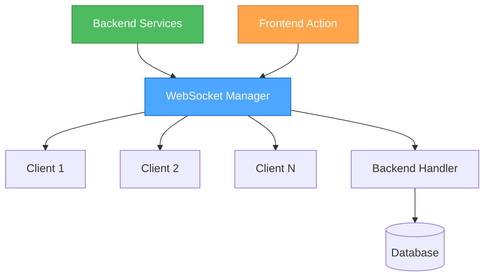
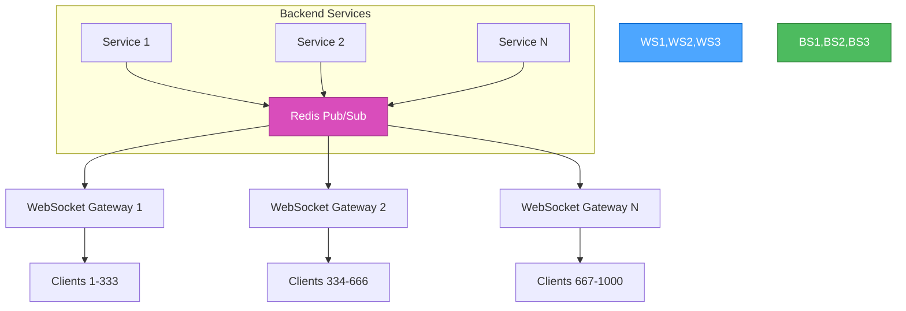
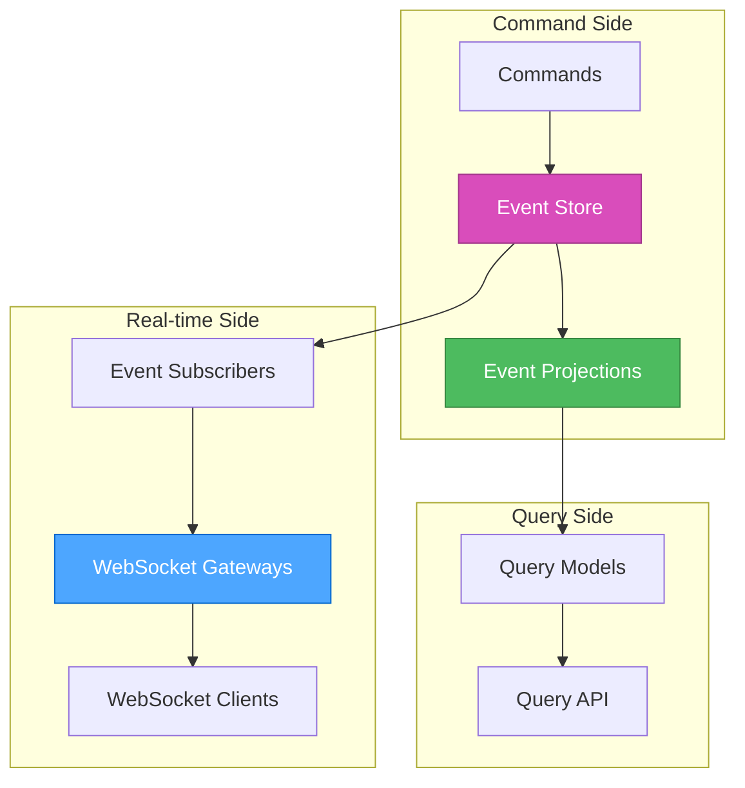
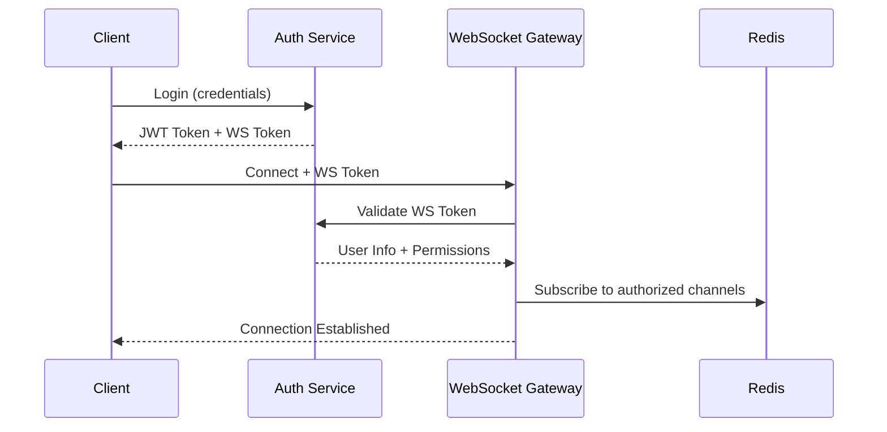

# 🎨🎨🎨 ENTERING CREATIVE PHASE: REAL-TIME ARCHITECTURE 🎨🎨🎨

**Focus:** Event-driven architecture для efficient real-time updates  
**Objective:** Design scalable WebSocket-based system для live detector status и anomaly notifications  
**Requirements:** Handle 1000+ concurrent connections, <50ms latency, graceful degradation  

## 📋 ARCHITECTURE DECISION RECORD: REAL-TIME SYSTEM

### Context

#### System Requirements
- **Real-time Updates**: Detector status changes, anomaly alerts, system metrics
- **Concurrent Users**: Support 1000+ simultaneous connections  
- **Low Latency**: Message delivery <50ms, UI updates <100ms
- **Reliability**: Graceful degradation, automatic reconnection
- **Scalability**: Horizontal scaling capability
- **State Sync**: Frontend state synchronized с backend changes

#### Technical Constraints  
- **Existing Stack**: Go backend, React frontend, Redis available
- **Infrastructure**: Kubernetes deployment, load balancer support
- **Security**: Authentication/authorization required
- **Monitoring**: Integration с Prometheus metrics

### Component Analysis

#### Core Components
- **WebSocket Manager**: Connection lifecycle, message routing
- **Event Publisher**: Backend event generation и distribution  
- **Event Consumer**: Frontend event processing и state updates
- **State Synchronizer**: Consistency management between client/server
- **Connection Pool**: Scalable connection management

#### Interactions
- **Backend Services** → **Event Publisher** → **WebSocket Manager** → **Frontend Client**
- **Frontend Actions** → **WebSocket Manager** → **Backend Handler** → **Database**
- **External Events** (Prometheus) → **Event Publisher** → **All Clients**

---

## 🏗️ ARCHITECTURE OPTIONS EVALUATION

### Option 1: Direct WebSocket Broadcasting

**Description:** Simple WebSocket connections с direct message broadcasting



**Pros:**
- ✅ Simple implementation и debugging
- ✅ Low latency - direct connections
- ✅ Easy to understand и maintain
- ✅ Minimal infrastructure requirements

**Cons:**  
- ❌ Limited scalability (single server bottleneck)
- ❌ No message persistence for disconnected clients
- ❌ Difficult to implement advanced features (filtering, batching)
- ❌ Memory usage grows linearly с connections

**Technical Fit:** Medium (good for MVP, limited for scale)  
**Complexity:** Low  
**Scalability:** Low-Medium (single node limit)

### Option 2: Redis Pub/Sub с WebSocket Gateways

**Description:** Redis pub/sub для message distribution, multiple WebSocket gateway instances



**Pros:**
- ✅ Horizontal scalability через multiple gateways
- ✅ Redis handles message distribution complexity
- ✅ Built-in persistence и replay capabilities
- ✅ Easy to add message filtering и routing
- ✅ Load balancing across gateway instances

**Cons:**
- ❌ Additional Redis dependency и complexity
- ❌ Slightly higher latency through Redis
- ❌ Need to handle Redis failover scenarios
- ❌ Message ordering complexity across gateways

**Technical Fit:** High (good balance of features и scalability)  
**Complexity:** Medium  
**Scalability:** High (horizontal scaling)

### Option 3: Event Sourcing с CQRS

**Description:** Full event sourcing с command/query separation



**Pros:**
- ✅ Complete audit trail и time-travel debugging
- ✅ Perfect consistency и replay capabilities  
- ✅ Supports complex business logic и workflows
- ✅ Excellent scalability и performance
- ✅ Natural fit for real-time event distribution

**Cons:**
- ❌ Very high implementation complexity
- ❌ Significant learning curve для team
- ❌ Overengineered для current requirements
- ❌ Long development time

**Technical Fit:** Low (overkill для current needs)  
**Complexity:** Very High  
**Scalability:** Very High

---

## 🎯 DECISION: REDIS PUB/SUB С WEBSOCKET GATEWAYS

### Rationale

**Chosen Option:** Option 2 - Redis Pub/Sub с WebSocket Gateways

**Key Decision Factors:**
1. **Scalability Requirements**: Need to support 1000+ concurrent connections  
2. **Implementation Timeline**: 1-2 weeks available for implementation
3. **Team Expertise**: Go и Redis knowledge available
4. **Future Growth**: Architecture supports adding more features
5. **Infrastructure Fit**: Redis already available в stack

### Implementation Considerations

#### Backend Architecture
```go
// Event Publisher Service
type EventPublisher struct {
    redisClient *redis.Client
    topics      map[string]string
}

func (ep *EventPublisher) PublishDetectorStatus(detectorID string, status DetectorStatus) error {
    event := Event{
        Type:      "detector.status.changed",
        Payload:   status,
        Timestamp: time.Now(),
        Metadata:  map[string]interface{}{"detector_id": detectorID},
    }
    return ep.redisClient.Publish(ctx, "events.detectors", event)
}

// WebSocket Gateway
type WebSocketGateway struct {
    redisClient    *redis.Client
    connections    *ConnectionPool
    subscriptions  map[string]*redis.PubSub
    eventRouter    *EventRouter
}

func (wsg *WebSocketGateway) handleConnection(conn *websocket.Conn) {
    // Connection lifecycle management
    // Subscribe to relevant Redis channels
    // Route messages to client
    // Handle client disconnections
}
```

#### Frontend Architecture  
```typescript
// WebSocket Redux Middleware
const webSocketMiddleware: Middleware = store => next => action => {
    if (action.type.startsWith('ws/')) {
        // Handle WebSocket-specific actions
        return websocketManager.send(action);
    }
    return next(action);
};

// Event Processing
class WebSocketManager {
    private connection: WebSocket | null = null;
    private reconnectAttempts = 0;
    private eventHandlers = new Map<string, Function>();
    
    connect() {
        this.connection = new WebSocket(WS_URL);
        this.connection.onmessage = (event) => {
            const message = JSON.parse(event.data);
            this.handleEvent(message);
        };
    }
    
    handleEvent(event: WSEvent) {
        // Route events to appropriate Redux slice
        switch(event.type) {
            case 'detector.status.changed':
                store.dispatch(detectorSlice.actions.updateStatus(event.payload));
                break;
            case 'anomaly.detected':
                store.dispatch(anomalySlice.actions.addAnomaly(event.payload));
                break;
        }
    }
}
```

### Message Protocol Design

#### Event Structure
```json
{
    "id": "uuid-v4",
    "type": "detector.status.changed",
    "timestamp": "2024-12-28T10:00:00Z",
    "payload": {
        "detector_id": "detector-123",
        "status": "running",
        "metrics": {
            "processed_events": 1542,
            "anomalies_detected": 3,
            "last_update": "2024-12-28T09:59:55Z"
        }
    },
    "metadata": {
        "tenant_id": "tenant-1",
        "source": "detector-service"
    }
}
```

#### Event Types
```typescript
// Detector Events
'detector.status.changed' | 'detector.created' | 'detector.deleted' | 'detector.configured'

// Anomaly Events  
'anomaly.detected' | 'anomaly.resolved' | 'anomaly.acknowledged'

// System Events
'system.health.updated' | 'system.metrics.updated' | 'system.alert.triggered'

// Connection Events
'connection.established' | 'connection.authenticated' | 'connection.subscribed'
```

### Scalability Strategy

#### Connection Distribution
```go
// Load Balancer Configuration
type LoadBalancer struct {
    gateways        []string
    connectionCount map[string]int
    strategy        BalancingStrategy
}

// Distribute connections across gateway instances
func (lb *LoadBalancer) selectGateway() string {
    // Round-robin или least-connections strategy
    return lb.gateways[lb.nextIndex()]
}
```

#### Redis Channel Design
```go
// Channel Naming Convention
const (
    DETECTOR_EVENTS = "events.detectors"
    ANOMALY_EVENTS  = "events.anomalies" 
    SYSTEM_EVENTS   = "events.system"
    TENANT_EVENTS   = "events.tenant.%s" // Per-tenant channels
)

// Subscription Management
type SubscriptionManager struct {
    userSubscriptions map[string][]string
    tenantFilters     map[string]string
}
```

---

## 🎨 CREATIVE CHECKPOINT: ARCHITECTURE FOUNDATION

**Progress:** ✅ Core architecture designed, protocols defined  
**Decisions:** 
- ✅ Redis Pub/Sub с WebSocket Gateways chosen
- ✅ Event structure и message protocol designed  
- ✅ Scalability strategy outlined

**Next Steps:** Design state synchronization patterns

---

## 🔄 STATE SYNCHRONIZATION PATTERNS

### Challenge: Optimistic Updates vs Consistency

When user performs action через UI, мы хотим:
1. **Immediate UI feedback** (optimistic updates)  
2. **Consistency** с backend state
3. **Conflict resolution** при failures

### Solution: Hybrid Optimistic/Pessimistic Pattern

```typescript
// Optimistic Update Pattern
class OptimisticUpdater {
    async updateDetector(id: string, changes: Partial<Detector>) {
        // 1. Immediately update UI (optimistic)
        dispatch(detectorSlice.actions.optimisticUpdate({id, changes}));
        
        try {
            // 2. Send request to backend
            const result = await api.updateDetector(id, changes);
            
            // 3. Confirm optimistic update
            dispatch(detectorSlice.actions.confirmUpdate({id, result}));
            
        } catch (error) {
            // 4. Rollback optimistic update
            dispatch(detectorSlice.actions.rollbackUpdate({id, error}));
            
            // 5. Show error to user
            showErrorNotification(error.message);
        }
    }
}

// State Management
interface DetectorState {
    detectors: Record<string, Detector>;
    optimisticUpdates: Record<string, Partial<Detector>>;
    pendingOperations: Record<string, Operation>;
}
```

### Real-time State Reconciliation

```typescript
// Handle WebSocket events that might conflict с optimistic updates
function handleDetectorStatusEvent(event: DetectorStatusEvent) {
    const hasOptimisticUpdate = store.getState().detectors.optimisticUpdates[event.detector_id];
    
    if (hasOptimisticUpdate) {
        // Don't override optimistic update, wait for API confirmation
        return;
    }
    
    // Safe to update from WebSocket event
    dispatch(detectorSlice.actions.updateFromEvent(event));
}
```

---

## 🔒 SECURITY CONSIDERATIONS

### Authentication Flow


### Authorization Strategy
```go
type UserContext struct {
    UserID      string
    TenantID    string
    Permissions []Permission
    Channels    []string // Authorized Redis channels
}

func (wsg *WebSocketGateway) authorizeSubscription(userCtx UserContext, channel string) bool {
    // Check if user has permission для this channel
    return contains(userCtx.Channels, channel)
}
```

---

## 🎨🎨🎨 EXITING CREATIVE PHASE: REAL-TIME ARCHITECTURE 🎨🎨🎨

### Summary
Designed comprehensive real-time architecture using Redis Pub/Sub с WebSocket Gateways. Architecture balances simplicity, scalability, и feature requirements while maintaining compatibility с existing infrastructure.

### Key Decisions
1. **✅ Redis Pub/Sub Pattern** - Optimal balance of complexity и scalability
2. **✅ WebSocket Gateway Design** - Horizontal scaling capability  
3. **✅ Event-driven Protocol** - Structured message format с metadata
4. **✅ Optimistic Updates** - Hybrid pattern для immediate UI feedback
5. **✅ Security Integration** - JWT-based authentication с channel authorization

### Implementation Plan
- **Week 1:** Backend WebSocket Gateway и Event Publisher
- **Week 2:** Frontend WebSocket Manager и Redux integration  
- **Testing:** Connection stability, message delivery, error recovery

### Technology Requirements
- **Backend:** `gorilla/websocket`, Redis Go client
- **Frontend:** Native WebSocket API, Redux middleware
- **Infrastructure:** Redis cluster, load balancer configuration

**READY FOR IMPLEMENTATION** ✅

---

*Creative Phase completed: 28 декабря 2024*  
*Architecture document: creative-realtime-architecture.md*  
*Next Phase: Advanced ML Pipeline Architecture* 